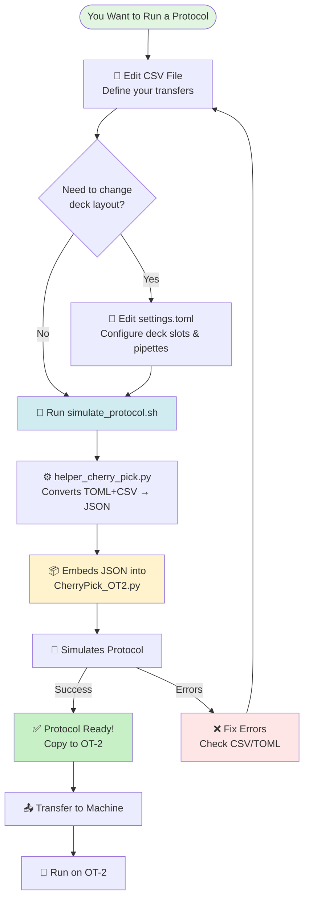
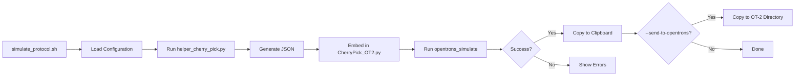

# CherryPick OT-2 Protocol Tutorial

**A Complete Guide to Cherry-Picking with the Opentrons OT-2 Robot**

---

## Table of Contents

1. [What is CherryPick OT-2?](#what-is-cherrypick-ot-2)
2. [How the System Works](#how-the-system-works)
3. [Quick Start Guide](#quick-start-guide)
4. [Understanding the Files](#understanding-the-files)
5. [Configuring settings.toml](#configuring-settingstoml)
6. [Working with labware_dict.toml](#working-with-labware_dicttoml)
7. [Creating Your Transfer CSV Files](#creating-your-transfer-csv-files)
8. [Running the Simulation Script](#running-the-simulation-script)
9. [Transferring to the OT-2 Machine](#transferring-to-the-ot-2-machine)
10. [Troubleshooting](#troubleshooting)
11. [Additional Resources](#additional-resources)

---

## What is CherryPick OT-2?

The CherryPick OT-2 system is a **self-contained protocol generator** for the Opentrons OT-2 liquid handling robot. It allows you to:

- **Define liquid transfers** in simple CSV files (like Excel spreadsheets)
- **Configure your deck layout** using easy-to-edit TOML files
- **Generate a complete protocol** that runs directly on the OT-2 machine
- **Test everything** with simulation before touching real samples

The system handles complex pipetting tasks like cherry-picking samples from multiple source tubes into specific destination wells with precise control over volumes, heights, and flow rates.

---

## How the System Works



### The Three File Types

#### 🟢 **Files You'll Edit Often** (Every Protocol Run)

- **CSV Files** (`CSVs/*.csv`) - Your transfer instructions
- **settings.toml** - Deck layout and liquid handling parameters

#### 🟡 **Files You'll Rarely Edit** (Only When Adding New Labware)

- **labware_dict.toml** - Labware definitions and calibrations

#### 🔵 **Files You Never Edit Manually** (Auto-Generated)

- **CherryPick_OT2.py** - The final protocol (generated automatically)

---

## Quick Start Guide

### Prerequisites

Before you begin, you need:

1. **WSL (Windows Subsystem for Linux)** installed on your Windows machine
2. **UV package manager** (Python package manager - will be used to set up the environment automatically)
3. **Text editor** for editing configuration files (Notepad, Notepad++, or any editor you prefer)
4. Basic familiarity with editing text files and running terminal commands

### Setting Up Your Coding Environment

Follow these steps to set up the cherry-pick protocol system on your computer:

**Step 1: Obtain the Project Files**

The essential project files are available on the shared network location:

```
\\158.194.103.28\domling\Instrument_OT-2\protocols\cherrypick
```

These files include:
- `CSVs/` - Directory for transfer CSV files
- `CherryPick_OT2.py` - Main protocol file
- `helper_cherry_pick.py` - Configuration compiler
- `simulate_protocol.sh` - Simulation script
- `settings.toml` - Configuration file
- `labware_dict.toml` - Labware definitions
- `pyproject.toml` - Package manifest
- `OT2_UserGuide/` - Documentation files (this guide!)
- `src/` - Source code directory

**Step 2: Copy Files to Your Working Location**

1. Navigate to the network location in Windows File Explorer
2. Copy **all** the project files to your desired working directory on your computer
   - Example destination: `D:\OpenTrons\my_protocols\` or any location you prefer
   - **Important:** Keep all files together in the same directory - the system expects this structure

**Step 3: Open Terminal in Project Directory**

1. In Windows File Explorer, navigate to your project directory (where you copied the files)
2. Right-click inside the folder → Select **"Open in Terminal"**
3. In the terminal window, type `wsl` and press Enter

**Step 4: Initialize the Environment (First Time Only)**

Run this command to set up all dependencies automatically:
```bash
uv sync
```

**What this does:**
- UV reads the `pyproject.toml` file
- Creates a local `.venv/` directory with Python environment
- Installs all required packages (Opentrons API, etc.)
- Sets up everything needed to run protocols

**Important:** This command only needs to be run **once** when you first set up the project. After that, you can skip directly to editing configuration files and running protocols.

---

## Understanding the Files

### File Structure Overview

```
cherrypick/
├── CherryPick_OT2.py          # 🔵 Final protocol (auto-generated)
├── helper_cherry_pick.py      # 🔧 Conversion script
├── simulate_protocol.sh       # 🚀 Main execution script
├── settings.toml              # 🟢 Deck layout & liquid handling
├── labware_dict.toml          # 🟡 Labware definitions
└── CSVs/                      # 🟢 Your transfer instructions
    ├── example_basic.csv
    ├── example_advanced.csv
    └── example_multi_mode.csv
```

### The Self-Contained Protocol

**CherryPick_OT2.py** is special - it contains everything needed to run on the OT-2:

```python
def get_values(*names):
    import json
    _all_values = json.loads("""{"labware_dict":{...}, "settings":{...}, "csv_data":"..."}""")
    return [_all_values[n] for n in names]
```

This `get_values()` function contains a **single-line JSON string** with:
- All your labware definitions
- All your settings
- All your CSV transfer data

**You never edit this manually!** It's regenerated every time you run `simulate_protocol.sh`.

---

## Configuring settings.toml

The `settings.toml` file controls **how the robot operates** and **where labware is placed**.

### File Structure Overview

```toml
[settings.general]              # Basic protocol behavior
[settings.liquid_handling]      # Advanced liquid handling parameters
[[settings.working_plate]]      # Deck layout (one entry per labware)
```

> **⚠️ IMPORTANT NOTE ABOUT LIQUID HANDLING PRESETS**
>
> The `settings.toml` file contains a section called `[settings.liquid_handling.presets]` with various preset configurations (standard, viscous, slippery, etc.). **These presets are NOT currently active features.** They exist in the configuration file for documentation purposes only and are not automatically applied by the system.
>
> The liquid handling parameters that ARE active and control robot behavior are:
> - `[settings.liquid_handling.pre_aspirate_contact]`
> - `[settings.liquid_handling.post_aspirate_wick]`
> - `[settings.liquid_handling.delays]`
> - `[settings.liquid_handling.push_out]`
> - `[settings.liquid_handling.mixing]`
>
> You must manually edit these active sections to configure liquid handling behavior for your protocol.

### General Settings (Change These Often)

```toml
[settings.general]
tip_reuse = "always"            # How to manage tips
mode = "multi"                  # Pipette mode
starting_tip_well = "H1"        # Starting tip for multi_X1 mode
```

#### Tip Reuse Options

| Value          | Behavior                            | When to Use                    |
| -------------- | ----------------------------------- | ------------------------------ |
| `"always"`     | Use one tip for entire protocol     | Transferring same liquid type  |
| `"never"`      | New tip for every transfer          | Preventing cross-contamination |
| `"per_source"` | New tip when source labware changes | Multiple source plates         |

#### Pipette Mode Options

| Value         | Description                   | Use Case                                   |
| ------------- | ----------------------------- | ------------------------------------------ |
| `"single_X1"` | Single-channel pipette        | One transfer at a time                     |
| `"multi_X1"`  | 8-channel pipette, single tip | Cherry-picking with multi-channel hardware |
| `"multi"`     | 8-channel pipette, all 8 tips | Full column transfers (8 wells at once)    |

> **💡 Tip:** Use `"multi_X1"` when you have an 8-channel pipette but want to cherry-pick individual wells!

#### Starting Tip Well Configuration

```toml
starting_tip_well = "H1"        # Starting tip for multi_X1 mode
```

**What it does:** Specifies which tip position on the 8-channel pipette to use when operating in `multi_X1` mode.

**Understanding tip positions from the pipette's perspective:**
- An 8-channel pipette has 8 tips arranged vertically: positions A, B, C, D, E, F, G, H
- **`A1`** = FIRST tip (position 1, topmost)
- **`H1`** = LAST tip (position 8, bottommost)

**Valid values:** Only `"A1"` or `"H1"` make sense due to the physical geometry of the pipette and tip rack:
- `"H1"` (recommended): Uses the last/bottom tip - easier to see and access
- `"A1"`: Uses the first/top tip

**When this setting matters:**
- **`multi_X1` mode:** This setting determines which single tip is used for all transfers
- **`single_X1` mode:** Ignored (single-channel pipette has only 1 tip)
- **`multi` mode:** Ignored (all 8 tips are used simultaneously)

> **💡 Note:** The code will simply ignore this setting in `single_X1` and `multi` modes, so you don't need to change it when switching between modes.

### Head Speed Configuration

```toml
[settings.general.head_speed]
speed = 400                     # Movement speed in mm/min (100-600)
```

**What it does:** Controls how fast the pipette head moves between positions (not liquid aspiration/dispense speed).

**Default value:** 400 mm/min (recommended for most applications)

**When to adjust:** The primary reason to reduce head speed is when working with **very slippery or volatile solvents** that tend to leak or drip from the pipette tip during movement. Slowing down the head movement (to 200-300 mm/min) reduces the mechanical vibration and sudden accelerations that can cause droplets to escape from the tip. This is particularly important for low surface tension liquids like chloroform, hexane, or other organic solvents.

For standard aqueous solutions, the default speed of 400 mm/min should not be changed.

### Liquid Handling Parameters

These settings control **how** the robot handles liquids physically. Understanding these parameters helps you optimize accuracy and reliability for different liquid types.

#### Pre-Aspirate Contact

```toml
[settings.liquid_handling.pre_aspirate_contact]
enabled = false                 # Touch liquid before aspirating?
position_offset_percent = 20    # Safety margin (%)
aspirate_volume = 0             # Pre-wet volume (µL)
```

**What it does:** Before aspirating your target volume, the pipette can first touch the liquid surface and optionally perform a small aspirate-dispense cycle.

**Scientific rationale:**
- **Pre-wetting (aspirate_volume > 0):** Increases humidity inside the tip and coats the inner surface with liquid. This is critical for liquids with high surface tension or hydrophobic properties. The first aspiration into a dry tip is often less accurate due to evaporation and surface adhesion effects. Pre-wetting "primes" the tip by saturating the air cushion inside.
- **Liquid contact (enabled = true, aspirate_volume = 0):** Simply touching the liquid surface helps the pipette detect the liquid level and ensures the tip is properly positioned before drawing liquid.

#### Post-Aspirate Tip Wicking

```toml
[settings.liquid_handling.post_aspirate_wick]
enabled = true                  # Remove droplets after aspiration?
radius = 1                      # Touch radius (mm)
v_offset_mm = -1.5              # Distance from top (mm)
speed = 20                      # Touch speed (mm/s)
```

**What it does:** After aspirating liquid, the pipette tip touches the inside wall of the well to remove any droplets hanging from the outside of the tip.

**Scientific rationale:** External droplets on the tip can cause:
- **Inaccurate volume delivery** - liquid not inside the tip won't be dispensed correctly
- **Cross-contamination** - droplets can fall off during movement
- **Dripping** - surface droplets may drip during transport

The wicking motion is similar to how you'd touch a manual pipette tip to the well edge to remove excess liquid.

**Parameters explained:**
- **radius:** How far from center to touch (larger = closer to wall)
- **v_offset_mm:** Height relative to well top (negative = below rim)
- **speed:** How fast to perform the touch (slower = more gentle)

#### Post-Aspirate Delays

```toml
[settings.liquid_handling.delays]
post_aspirate = 0               # Wait time after aspiration (seconds)
```

**What it does:** Pauses after aspirating liquid to allow the liquid column inside the tip to stabilize.

**Scientific rationale:** When you aspirate liquid, especially viscous liquids, the liquid continues flowing into the tip for a brief moment after the plunger stops moving. This is due to:
- **Viscous flow lag:** Thick liquids move slower and take time to stabilize
- **Surface tension effects:** Liquid is "pulling itself" into the tip
- **Air pressure equilibration:** Pressure inside the tip needs to stabilize

Waiting 1-2 seconds ensures the full intended volume has been aspirated before the tip leaves the liquid.

**When to use:**
- **Viscous liquids (glycerol, DMSO, high-concentration proteins):** Use 2-3 seconds
- **Very small volumes (< 5µL):** Use 1 second to ensure complete aspiration
- **High-accuracy requirements:** Even 0.5-1 second can improve reproducibility

**Recommended values:**
- Water/buffers: 0 seconds (default)
- DMSO/glycerol: 2-3 seconds
- Oils/very viscous: 3-5 seconds

#### Push-Out Volume

```toml
[settings.liquid_handling.push_out]
enabled = true                  # Force out remaining liquid?
volume_ul = 5                   # Extra volume to push (µL)
```

**What it does:** After dispensing the target volume, the pipette pushes out an additional fixed volume of air to expel any liquid remaining in the tip.

**Scientific rationale:** This mimics the "second stop" on a manual pipette. Viscous liquids and small volumes tend to stick inside the tip rather than being fully dispensed. The push-out:
- **Expels residual droplets** that cling to the tip interior
- **Ensures complete delivery** of the intended volume
- **Compensates for surface tension** holding liquid in the tip

**Important:** Push-out is NOT used when mixing follows the dispense, as mixing already agitates the liquid sufficiently.

**When to enable:**
- **Viscous liquids** (DMSO, glycerol, concentrated solutions)
- **Small volumes** where every microliter matters
- **Dead-end dispenses** with no subsequent mixing
- **Complete reagent delivery** is critical

**Recommended volume settings:**
- **3-5µL:** Good for most applications (default: 5µL)
- **8-10µL:** Very viscous liquids or complete cleanout
- Don't exceed 10µL unless necessary (can cause splashing)

### Deck Layout Configuration (Most Important!)

This section defines **where each labware is placed** on the deck.

```toml
[[settings.working_plate]]
type = "source"
labware_id = "tube_rack_96_1500ul"
position_rack = "4"

[[settings.working_plate]]
type = "destination"
labware_id = "384_ppv_55ul"
position_rack = "2"

[[settings.working_plate]]
type = "tip"
labware_id = "opentrons_96_tiprack_300ul"
connection = "Pipette_8"
position_rack = "5"
```

Each `[[settings.working_plate]]` block defines one piece of labware:

| Field           | Description                         | Example Values                       |
| --------------- | ----------------------------------- | ------------------------------------ |
| `type`          | Role of this labware                | `"source"`, `"destination"`, `"tip"` |
| `labware_id`    | ID from `labware_dict.toml`         | `"tube_rack_96_1500ul"`              |
| `position_rack` | Deck slot number                    | `"1"` through `"11"`                 |
| `connection`    | Which pipette uses this (tips only) | `"Pipette_8"`, `"Pipette_1"`         |

#### OT-2 Deck Layout Reference

```
┌─────┬─────┬─────┬─────┐
│ 10  │  11 │ Trash│     │
├─────┼─────┼─────┤     │
│  7  │  8  │  9  │     │
├─────┼─────┼─────┼─────┘
│  4  │  5  │  6  │
├─────┼─────┼─────┤
│  1  │  2  │  3  │
└─────┴─────┴─────┘
```

**Slot availability:**
- Slots 1-11 are available for labware placement
- Slot 12 is the fixed trash bin

### Example Deck Configurations

#### Simple Single-Source Setup
```toml
[[settings.working_plate]]
type = "source"
labware_id = "tube_rack_96_1500ul"
position_rack = "1"

[[settings.working_plate]]
type = "destination"
labware_id = "384_ppv_55ul"
position_rack = "2"

[[settings.working_plate]]
type = "tip"
labware_id = "opentrons_96_tiprack_300ul"
connection = "Pipette_8"
position_rack = "5"
```

#### Multiple Source Plates
```toml
[[settings.working_plate]]
type = "source"
labware_id = "tube_rack_96_1500ul"
position_rack = "1"

[[settings.working_plate]]
type = "source"
labware_id = "tube_rack_96_1500ul"
position_rack = "4"

[[settings.working_plate]]
type = "destination"
labware_id = "384_ppv_55ul"
position_rack = "2"

[[settings.working_plate]]
type = "tip"
labware_id = "opentrons_96_tiprack_300ul"
connection = "Pipette_8"
position_rack = "5"
```

In your CSV, reference these as:
- `tube_rack_96_1500ul_1` (slot 1)
- `tube_rack_96_1500ul_4` (slot 4)

---

## Working with labware_dict.toml

The `labware_dict.toml` file is a **reference library** of all available labware. You typically edit this file only when:

- Adding new labware to your lab
- Calibrating labware with position offsets
- Defining custom pipettes

### File Structure

```toml
[[pipettes]]                    # Pipette definitions
[[labware]]                     # Labware catalog
```

### Pipette Definitions

```toml
[[pipettes]]
name = "Pipette_8"
opentrons_id = "p300_multi_gen2"
channels = 8
volume_range = [30, 300]
preferred_mount = "right"
tip_connections = ["tip_rack_yellow_100ul"]
```

| Field             | Description                    | Common Values                              |
| ----------------- | ------------------------------ | ------------------------------------------ |
| `name`            | Your nickname for this pipette | `"Pipette_8"`, `"Pipette_1"`               |
| `opentrons_id`    | Official Opentrons pipette ID  | `"p300_multi_gen2"`, `"p1000_single_gen2"` |
| `channels`        | Number of channels             | `1`, `8`                                   |
| `volume_range`    | Min and max volume [µL]        | `[30, 300]`, `[100, 1000]`                 |
| `preferred_mount` | Which arm to mount on          | `"left"`, `"right"`                        |
| `tip_connections` | Compatible tip rack IDs        | List of tip rack names                     |

**⚠️ You rarely need to change pipette definitions** - they're set once during initial setup.

### Labware Definitions

```toml
[[labware]]
category = "tube_rack"
labware_id = "tube_rack_96_1500ul"
well_count = 96
well_volume = 1500
```

| Field         | Description              | Example Values                                        |
| ------------- | ------------------------ | ----------------------------------------------------- |
| `category`    | Type of labware          | `"tube_rack"`, `"plate"`, `"tip_rack"`, `"reservoir"` |
| `labware_id`  | Unique identifier        | `"tube_rack_96_1500ul"`                               |
| `well_count`  | Number of wells          | `96`, `384`, `12`                                     |
| `well_volume` | Max volume per well (µL) | `1500`, `55`, `15000`                                 |

### Labware Calibration Offsets ⚠️ CRITICAL SETTING

Labware calibration offsets are **three-dimensional position adjustments** that fine-tune where the pipette moves relative to each labware. This is one of the most important settings in the system.

**Coordinate System:**
- **X-axis**: Negative = left, Positive = right
- **Y-axis**: Negative = front, Positive = back
- **Z-axis**: Negative = down, Positive = up

#### Why Calibration Offsets Are Critical

In an ideal world, when you place labware on the OT-2 deck, the robot would know exactly where every well is located. In reality, small variations occur due to:

- **Manufacturing tolerances** - Even identical labware models vary slightly (±0.1-0.5mm)
- **Deck positioning** - Labware doesn't always sit perfectly flush in deck slots
- **Thermal expansion** - Plastic labware dimensions change with temperature
- **Wear and tear** - Repeated use can affect labware and deck slot alignment

These tiny misalignments (often less than 1mm) cause the pipette to miss well centers, leading to:
- Tips crashing into well edges
- Liquid dispensed onto labware edges instead of into wells
- Incomplete aspiration from wells
- Cross-contamination between adjacent wells

#### ⚠️ CRITICAL: Offsets are Position-Dependent

**Important discovery:** Calibration offsets depend on **BOTH the labware type AND the deck slot position**. The same labware placed in different deck slots may require different calibration offsets due to:
- Deck slot manufacturing variations
- Uneven deck surface
- Mechanical tolerances in different deck positions

This means:
- Slot 1 might need `offset_x = -0.3` for a specific plate
- Slot 2 might need `offset_x = +0.2` for the SAME plate type

#### How to Calibrate: The Recommended Method

**Recommended: Use Opentrons App Labware Position Check**

The best way to handle calibration is through the Opentrons App during protocol setup:

1. Load the protocol in the Opentrons App
2. Run **Labware Position Check** for each labware piece during setup
3. Manually jog the pipette to the correct position for each labware
4. Save the calibration offsets interactively

When you perform Labware Position Check in the Opentrons App, the software:

1. **Saves offset data on the robot** - Offsets are stored in the robot's internal database
2. **Associates offsets with specific conditions** - Each offset is tied to:
   - Specific labware definition (labware type/ID)
   - **Specific deck slot position** (this is key!)
   - Specific robot (offsets from one OT-2 don't transfer to another)
3. **Reuses offsets across protocols** - Starting with Opentrons software v6.0.0+, the robot can apply previously saved offsets automatically if you're using:
   - The same labware type
   - In the same deck slot
   - On the same robot

This method ensures each labware instance gets the correct calibration for its specific position.

#### Alternative: Define Offsets in labware_dict.toml (⚠️ USE WITH CAUTION)

While technically possible, defining offsets in `labware_dict.toml` is **NOT recommended** because:

```toml
[[labware]]
category = "plate"
labware_id = "384_ppv_55ul"
well_count = 384
well_volume = 55
offset_x = -0.50        # Move 0.5mm to the left
offset_y = 0.80         # Move 0.8mm toward back
offset_z = -0.30        # Move 0.3mm down
```

**The dangers:**

1. **Position-independent:** These offsets apply to **ALL instances** of that labware type, regardless of deck position. If you have the same labware in multiple slots, they all get the same offset, which may be incorrect for some positions.

2. **⚠️ CRITICAL: TOML offsets always override machine calibration**
   - **The TOML file always takes precedence** over any calibration you do on the machine
   - If offsets are defined in `labware_dict.toml`, the protocol embeds them and uses them unconditionally
   - **You cannot override these offsets** by running Labware Position Check in the Opentrons App
   - The machine will ignore its saved calibration data and use the TOML values instead
   - This means **if the TOML offset is wrong, you're stuck with it** until you edit the file and regenerate the protocol

**Why this is dangerous:**
- You might calibrate perfectly on the machine, but the protocol will still use the wrong TOML offset
- Troubleshooting becomes difficult because machine calibration appears to have no effect
- Users may waste time recalibrating when the real problem is the hardcoded TOML value

**When this might be acceptable:**
- You only use one instance of each labware type per protocol
- You've verified the offset works for all positions you use
- You need embedded offsets for automation purposes
- You understand that this disables manual calibration overrides

**For most users:** Skip offsets in `labware_dict.toml` and rely on the Opentrons App's position-aware calibration system instead. This keeps control where it belongs - with the machine operator who can see and adjust positioning in real-time.

### Adding New Labware

All available labware definitions are stored in the **shared network directory**:

```
\\158.194.103.28\domling\Instrument_OT-2\labware_json_V2
```

**This is your source of truth for all labware.** Do not search online - all labware that can be used with your OT-2 system is in this directory.

**Step 1: Find the labware in the network directory**
- Open the network location: `\\158.194.103.28\domling\Instrument_OT-2\labware_json_V2`
- Browse the JSON files to find your labware
- The filename (without `.json`) is the labware API name
- For example: `tube_rack_96_1500ul.json` → Use `tube_rack_96_1500ul`

**Step 2: Add to labware_dict.toml**
```toml
[[labware]]
category = "tube_rack"
labware_id = "tube_rack_96_1500ul"
well_count = 96
well_volume = 1500
# Add calibration offsets if needed
# offset_x = 0.0
# offset_y = 0.0
# offset_z = 0.0
```

**Step 3: Use in settings.toml**
```toml
[[settings.working_plate]]
type = "source"
labware_id = "tube_rack_96_1500ul"
position_rack = "4"
```

**Step 4: Reference in CSV**

| Source Labware        | Source Well | Volume (ul) | ... |
| --------------------- | ----------- | ----------- | --- |
| tube_rack_96_1500ul_4 | A1          | 100         | ... |

**Important:** If the labware you need is not in the network directory, contact your system administrator. New labware definitions must be added to the shared directory and loaded into the Opentrons App before they can be used.

---

## Creating Your Transfer CSV Files

CSV files define **what the robot should do** - which samples to move, how much, and where.

Now that you've configured your deck layout in `settings.toml` and defined your labware in `labware_dict.toml`, you're ready to create the CSV file that specifies your liquid transfers.

### Understanding Pipette Modes and CSV Structure

Before creating CSV files, you need to understand that **CSV structure depends on your pipette mode** (configured in `settings.toml`):

**Single-Channel Mode** (`mode = "single_X1"`):
- Uses a 1-channel pipette
- Each CSV row = 1 individual transfer
- Transfers happen one well at a time
- Maximum flexibility for cherry-picking

**Multi-Channel Single-Tip Mode** (`mode = "multi_X1"`):
- Uses an 8-channel pipette with only 1 tip active
- Each CSV row = 1 individual transfer
- Useful when you have multi-channel hardware but need single-well precision
- Transfers happen one well at a time

**Multi-Channel Full Mode** (`mode = "multi"`):
- Uses an 8-channel pipette with all 8 tips active
- Each CSV row = 8 simultaneous transfers (entire column)
- When you specify well `A1`, it transfers the entire column (A1-H1)
- Only works with 96-well and 384-well plates

> **💡 Key Point:** For `multi` mode, your CSV looks the same, but each row automatically transfers 8 wells at once. The well name in the CSV always refers to the row A position of the column you want to transfer.

### Required Columns (Always Include These)

| Column Name      | Description                    | Example Values          |
| ---------------- | ------------------------------ | ----------------------- |
| `Source Labware` | Name of source container       | `tube_rack_96_1500ul_4` |
| `Source Well`    | Source well position           | `A1`, `H12`             |
| `Volume (ul)`    | Transfer volume in microliters | `50`, `100.5`           |
| `Dest Labware`   | Name of destination container  | `384_ppv_55ul_2`        |
| `Dest Well`      | Destination well position      | `B1`, `P24`             |

### Position Columns (Choose ONE for Source, ONE for Destination)

**For Source Position:**

| Column Name     | Description               | When to Use                 | Example Values      |
| --------------- | ------------------------- | --------------------------- | ------------------- |
| `Source Height` | Distance from bottom (mm) | When you know liquid depth  | `2`, `5.5`, `10`    |
| `Source Top`    | Distance from top (mm)    | When avoiding foam/meniscus | `-5`, `-2.0`, `-10` |

**For Destination Position:**

| Column Name   | Description               | When to Use                  | Example Values |
| ------------- | ------------------------- | ---------------------------- | -------------- |
| `Dest Height` | Distance from bottom (mm) | Dispensing at specific depth | `1`, `2.5`     |
| `Dest Top`    | Distance from top (mm)    | Avoiding splashing           | `-3`, `-7.5`   |

> **⚠️ Important:** Use EITHER `Source Height` OR `Source Top` - never both! Same for destination.

### Optional Advanced Columns

| Column Name     | Default | Description                             | Example Values             |
| --------------- | ------- | --------------------------------------- | -------------------------- |
| `Mix Volume`    | `0`     | Volume to mix after dispense (µL)       | `20`, `50`                 |
| `Mix Height`    | `2.0`   | Mixing height from bottom (mm)          | `1.5`, `3.0`               |
| `Flow Aspirate` | `1.0`   | Aspiration speed multiplier             | `0.5` (slow), `1.5` (fast) |
| `Flow Dispense` | `1.0`   | Dispense speed multiplier               | `0.8` (slow), `2.0` (fast) |
| `Air Gap`       | `0`     | Air gap volume to prevent dripping (µL) | `5`, `10`, `20`            |
| `Air Gap Rate`  | `1.0`   | Air gap aspiration speed                | `0.5`, `1.0`               |
| `Tip Action`    | `auto`  | Override tip management                 | `new`, `keep`, `drop`      |

### CSV Examples

#### Example 1: Basic Transfer (Minimal Columns)

| Source Labware        | Source Well | Volume (ul) | Dest Labware   | Dest Well | Source Height | Dest Top |
| --------------------- | ----------- | ----------- | -------------- | --------- | ------------- | -------- |
| tube_rack_96_1500ul_4 | A1          | 100         | 384_ppv_55ul_2 | B1        | 2             | -5       |
| tube_rack_96_1500ul_4 | A2          | 50          | 384_ppv_55ul_2 | B2        | 2             | -5       |
| tube_rack_96_1500ul_4 | A3          | 75          | 384_ppv_55ul_2 | B3        | 2             | -5       |

**What this does:**
- Transfers from tube rack to 384-well plate
- Aspirates 2mm from bottom of source tubes
- Dispenses 5mm below top of destination wells
- Uses default flow rates and no mixing

#### Example 2: Advanced Transfer (All Features)

| Source Labware        | Source Well | Volume (ul) | Dest Labware   | Dest Well | Source Height | Dest Top | Mix Volume | Flow Aspirate | Flow Dispense | Air Gap | Tip Action |
| --------------------- | ----------- | ----------- | -------------- | --------- | ------------- | -------- | ---------- | ------------- | ------------- | ------- | ---------- |
| tube_rack_96_1500ul_4 | A1          | 30          | 384_ppv_55ul_2 | B1        | 2             | -5       | 0          | 1             | 1             | 20      | keep       |
| tube_rack_96_1500ul_4 | A2          | 30          | 384_ppv_55ul_2 | B2        | 2             | -5       | 0          | 0.5           | 1.2           | 20      | keep       |
| tube_rack_96_1500ul_4 | A3          | 30          | 384_ppv_55ul_2 | B3        | 3             | -8       | 20         | 1             | 1             | 20      | new        |

**What this does:**
- Row 1: Standard transfer with 20µL air gap, keep tip
- Row 2: Slow aspiration (0.5x), fast dispense (1.2x), keep tip
- Row 3: Aspirate 3mm from bottom, mix 20µL after dispense, get new tip

#### Example 3: Multi-Channel Mode

| Source Labware        | Source Well | Volume (ul) | Dest Labware   | Dest Well | Source Height | Dest Top | Air Gap | Tip Action |
| --------------------- | ----------- | ----------- | -------------- | --------- | ------------- | -------- | ------- | ---------- |
| tube_rack_96_1500ul_4 | A1          | 30          | 384_ppv_55ul_2 | A1        | 5             | -2       | 30      | keep       |
| tube_rack_96_1500ul_4 | A2          | 30          | 384_ppv_55ul_2 | B1        | 5             | -2       | 30      | keep       |

**What this does:**
- In multi-channel mode, transfers entire columns at once
- `A1` means column 1 (wells A1-H1)
- Each row transfers 8 samples simultaneously

### Labware Naming in CSV

The `Source Labware` and `Dest Labware` columns use this pattern:

```
{labware_id}_{instance_number}
```

**Examples:**
- `tube_rack_96_1500ul_4` → The labware defined in `labware_dict.toml` with ID `tube_rack_96_1500ul`, instance at deck slot **4**
- `384_ppv_55ul_2` → The labware with ID `384_ppv_55ul`, instance at deck slot **2**

The instance number **must match the `position_rack` in settings.toml**!

#### Understanding Labware API Names

The labware IDs you use (like `tube_rack_96_1500ul` or `384_ppv_55ul`) come from **JSON definition files** stored on the shared network location:

```
\\158.194.103.28\domling\Instrument_OT-2\labware_json_V2
```

**How labware names are determined:**
- Each labware is defined by a JSON file in this directory
- The **filename (without the .json extension)** is the labware API name
- For example: `tube_rack_96_1500ul.json` → API name is `tube_rack_96_1500ul`
- This API name is what you use in `labware_dict.toml` and reference in CSV files

**Important note about labware definitions:**

For the OT-2 machine to recognize custom labware, these JSON files must be loaded into the main Opentrons application. This is a **one-time setup task** performed by system administrators. Once labware is properly loaded, regular users don't need to worry about this step - the machine will have access to all defined labware automatically.

For regular protocol operation, you simply need to ensure that:
1. The labware you want to use has a JSON file in the network location (`\\158.194.103.28\domling\Instrument_OT-2\labware_json_V2`)
2. It has been loaded into the Opentrons app (done once by admin)
3. You define it in `labware_dict.toml`
4. You reference it correctly in your CSV files

### CSV File Constraints and Rules

✅ **Do's:**
- Use column headers exactly as shown (case-sensitive!)
- Ensure all required columns are present
- Use decimal points for fractional volumes: `50.5` not `50,5`
- Keep well names uppercase: `A1` not `a1`
- Include all transfers in order of execution

❌ **Don'ts:**
- Don't use both `Source Height` and `Source Top` for the same transfer
- Don't reference labware not defined in `labware_dict.toml`
- Don't use instance numbers not configured in `settings.toml`
- Don't exceed pipette volume ranges
- Don't use commas in numbers (use `1000` not `1,000`)
- Don't leave empty rows in the middle of your CSV

#### Why Height Consistency Matters for Labware

When working with the same type of labware throughout your protocol, it's strongly recommended to use **consistent height values** for all transfers involving that labware. Here's why:

**Physical consistency:** All wells in the same labware have identical geometry. If well A1 in your tube rack requires aspirating at 2mm from the bottom to avoid drawing air, then well A2, A3, B1, etc. will have the same optimal height. The liquid level might vary slightly between wells, but the safe aspiration height relative to the well bottom remains constant for that labware type.

**Avoiding errors:** Using different heights for the same labware type often indicates either:
- An inconsistency in your protocol design
- Uncertainty about the correct height (which should be tested and standardized)
- A mistake in data entry

**Exception - varying liquid volumes:** The main exception is when you're working with significantly different liquid volumes in the same labware. For example, if some source tubes have 1500µL and others have only 200µL, you might use `Source Top` with different negative offsets to account for different meniscus levels. However, even in this case, using a single safe height that works for all volumes is usually preferable.

**Best practice:** Test your labware with water to find the optimal aspiration/dispense heights, then use those same values consistently throughout your CSV. Document these standard heights for each labware type for future protocols. This approach:
- Reduces errors from typos or inconsistencies
- Makes your CSV easier to review and validate
- Ensures reproducible pipetting across all wells
- Simplifies troubleshooting when issues occur

---

## Running the Simulation Script

Now that you've configured your settings, labware, and created your CSV file, you're ready to run the protocol simulation!

The `simulate_protocol.sh` script is your **main control center**. It does everything automatically:

1. Reads your CSV file, `settings.toml`, and `labware_dict.toml`
2. Runs `helper_cherry_pick.py` to convert everything into JSON format
3. Embeds the JSON configuration into `CherryPick_OT2.py`
4. Simulates the protocol using the Opentrons API to check for errors
5. If successful, copies the ready-to-run protocol to your clipboard

### Running Your First Protocol

**Step 1: Open Terminal in Your Project Directory**

1. In Windows File Explorer, navigate to your project directory (where you copied the files)
2. Right-click inside the folder → Select **"Open in Terminal"**
3. Type `wsl` and press Enter

**Step 2: Run the Simulation**

The core command is `simulate_protocol.sh` followed by the path to your CSV file:

```bash
./simulate_protocol.sh CSVs/example_basic.csv
```

**Understanding the Command:**
- `./simulate_protocol.sh` - The main simulation script
- `CSVs/example_basic.csv` - Path to your CSV transfer file
- You can use any CSV file in the `CSVs/` directory or create your own

**Step 3: Check the Simulation Output**

You should see output like:
```
=== Step 1: Updating protocol with helper ===
Loading labware definitions...
Loading settings...
Loading CSV data...

=== Step 2: Running protocol simulation ===
Loading labware at slots...
Picking up tip...
Transferring...

✓ Simulation successful!
✓ Protocol copied to clipboard
```

**Success Indicators:**
- ✓ No error messages
- ✓ All transfers listed correctly
- ✓ "Simulation successful" message
- ✓ Protocol copied to clipboard

**If You See Errors:**
- Read the error messages carefully
- Common issues: missing labware, wrong well names, volume out of range
- Check your CSV file and TOML configuration files
- See the Troubleshooting section below for solutions

### Basic Usage

```bash
./simulate_protocol.sh CSVs/your_file.csv
```

### With Protocol Transfer to OT-2

```bash
./simulate_protocol.sh CSVs/your_file.csv --send-to-opentrons
```

This automatically overwrites the protocol in your configured Opentrons directory.

### What the Script Does



### Script Configuration

At the top of `simulate_protocol.sh`, you'll find machine configuration:

```bash
MACHINE_CONFIG="local"
```

**Available configurations:**
- `"local"` - Your development machine
- `"remote"` - The OT-2 control PC

Each configuration sets two key variables:

#### 1. LABWARE_PATH_WIN
**Windows-style path** to custom labware JSON files:
```bash
LABWARE_PATH_WIN="C:\Users\ricca\AppData\Roaming\Opentrons\labware"
```

**Understanding this path:**
- This is a **Windows path**, not a WSL/Linux path
- It points to where the Opentrons App stores custom labware definitions
- The script automatically converts it to WSL format using `wslpath`
- This is the same directory referenced in the network location for labware

#### 2. TARGET_PROTOCOL_SRC_WIN (Critical for --send-to-opentrons)
**Windows-style path** to the Opentrons App protocol source directory:
```bash
TARGET_PROTOCOL_SRC_WIN="C:\Users\ricca\AppData\Roaming\Opentrons\protocols\ea8382af-2299-4bc5-b556-81524aa7d0b6\src"
```

**Understanding this path:**
- This is a **Windows path**, not a WSL/Linux path
- It points to where the Opentrons App stores protocol files
- The script automatically converts it to WSL format using `wslpath`
- The UUID part (`ea8382af-2299-4bc5-b556-81524aa7d0b6`) is **generated by the Opentrons App** when you create or import a protocol

**Path structure breakdown:**
```
C:\Users\{username}\AppData\Roaming\Opentrons\protocols\{UUID}\src
```

- `{username}` - Your Windows username
- `{UUID}` - Unique identifier generated by Opentrons App for each protocol
- `\src` - Subdirectory containing the actual Python protocol file

**Note:** With the UV-based setup, the script automatically uses the local `.venv/` environment created by `uv sync`, so no additional environment configuration is needed.

### How to Configure TARGET_PROTOCOL_SRC_WIN for --send-to-opentrons

The `--send-to-opentrons` flag requires you to specify where your protocol lives in the Opentrons App. Here's how to find and configure this path:

**Step 1: Create or Import a Protocol in Opentrons App**
1. Open the Opentrons App on Windows
2. Either create a new protocol or import an existing one
3. The app automatically generates a unique folder with a UUID for this protocol

**Step 2: Find the Protocol's Windows Path**

The Opentrons App stores protocols in:
```
C:\Users\{YourUsername}\AppData\Roaming\Opentrons\protocols\
```

Inside this directory, you'll find folders with UUID names like:
```
C:\Users\ricca\AppData\Roaming\Opentrons\protocols\
├── ea8382af-2299-4bc5-b556-81524aa7d0b6\
│   └── src\
│       └── protocol.py
├── f9d12b4a-8c3e-4f1d-9a2b-7e6f3d8c9a1b\
│   └── src\
│       └── my_protocol.py
└── ...
```

**Step 3: Identify the Correct UUID**
- Each UUID folder corresponds to one protocol in the Opentrons App
- To find which UUID belongs to which protocol:
  - Open File Explorer and navigate to `C:\Users\{YourUsername}\AppData\Roaming\Opentrons\protocols\`
  - Look at the modification dates of the UUID folders
  - OR open the `src\` folder inside each UUID directory and check the Python filename
  - OR check inside the Opentrons App - protocol metadata usually includes the path

**Step 4: Configure the Script**

Edit `simulate_protocol.sh` and set both Windows paths:

```bash
setup_environment() {
    case "$MACHINE_CONFIG" in
        "local")
            # Configure Windows paths - will be auto-converted to WSL format
            LABWARE_PATH_WIN="C:\Users\ricca\AppData\Roaming\Opentrons\labware"
            TARGET_PROTOCOL_SRC_WIN="C:\Users\ricca\AppData\Roaming\Opentrons\protocols\YOUR-UUID-HERE\src"
            ;;
```

**Important notes about the path format:**
- ✅ **DO use Windows-style backslashes:** `C:\Users\...`
- ✅ **DO include** the `\src` at the end of `TARGET_PROTOCOL_SRC_WIN`
- ❌ **DON'T use WSL/Linux slashes:** `/mnt/c/Users/...`
- ❌ **DON'T add quotes** around the paths in the script (quotes are already in the example)

**Why Windows paths in WSL?**

You might wonder why we use Windows-style paths when running from WSL. The reason is **convenience**:
- Windows paths (`C:\Users\...`) are easier to copy directly from File Explorer or Windows dialogs
- The script automatically handles the conversion to WSL format (`/mnt/c/Users/...`) for both paths
- It uses the `wslpath` command to perform this conversion transparently
- This way, you can copy-paste paths directly from Windows without manual conversion

**Path Conversion Details:**

The script performs automatic conversion for both paths:
```bash
# You configure (Windows style):
LABWARE_PATH_WIN="C:\Users\ricca\AppData\Roaming\Opentrons\labware"
TARGET_PROTOCOL_SRC_WIN="C:\Users\ricca\AppData\Roaming\Opentrons\protocols\{UUID}\src"

# Script converts to (WSL style):
LABWARE_PATH="/mnt/c/Users/ricca/AppData/Roaming/Opentrons/labware"
TARGET_PROTOCOL_SRC="/mnt/c/Users/ricca/AppData/Roaming/Opentrons/protocols/{UUID}/src"
```

This conversion happens automatically when you run the script - you don't need to do anything!

### Understanding Simulation Output

When you run the script, you'll see output like:

```
=== Using local configuration ===
=== Step 1: Updating protocol with helper ===
Loading labware definitions...
Loading settings...
Loading CSV data...
Embedding configuration into CherryPick_OT2.py...

=== Step 2: Running protocol simulation ===
Loading labware: tube_rack_96_1500ul at slot 4
Loading labware: 384_ppv_55ul at slot 2
Loading labware: opentrons_96_tiprack_300ul at slot 5
Picking up tip from A1
Aspirating 100.0 uL from tube_rack_96_1500ul:A1
Dispensing 100.0 uL into 384_ppv_55ul:B1
Dropping tip

=== Simulation successful! Copying CherryPick_OT2.py to clipboard ===
Protocol copied to clipboard ✓
```

**Key sections:**
1. **Configuration loading** - Confirms which settings are used
2. **Labware loading** - Shows deck layout
3. **Transfer simulation** - Lists each action
4. **Success/Error** - Final result

---

## Transferring to the OT-2 Machine

Once your simulation succeeds, you need to get the protocol onto the OT-2.

### Method 1: Automatic Transfer (Recommended)

```bash
./simulate_protocol.sh CSVs/your_file.csv --send-to-opentrons
```

This automatically:
1. Simulates the protocol
2. Copies it to the configured Opentrons directory
3. Preserves the original filename

**Requirements:**
- `TARGET_PROTOCOL_SRC` must be configured in the script
- Path must point to a valid Opentrons protocol directory

### Method 2: Manual Clipboard Transfer

```bash
./simulate_protocol.sh CSVs/your_file.csv
```

Then:
1. Protocol is copied to clipboard automatically
2. Open Opentrons App
3. Import the `CherryPick_OT2.py`
4. Save

---

## Troubleshooting

> **📝 PLACEHOLDER: Troubleshooting Section**
>
> This section will be populated with common error messages and solutions as users encounter issues during protocol development and execution.

---

## Additional Resources

For more detailed information and practical examples, please refer to:

- **[EXAMPLES.md](EXAMPLES.html)** - Common use cases with complete CSV and settings configurations:
  - Simple cherry-picking from tube rack to 384-well plate
  - Multi-source transfers with mixing
  - Viscous liquid handling (DMSO)
  - Multi-channel column transfers
  - Variable volume cherry-picking

- **[APPENDIX.md](APPENDIX.html)** - Complete step-by-step workflow example:
  - Creating your first protocol from scratch
  - Full CSV file preparation with explanations
  - Configuration walkthroughs
  - Simulation verification
  - Transfer to OT-2 machine
  - Troubleshooting tips
