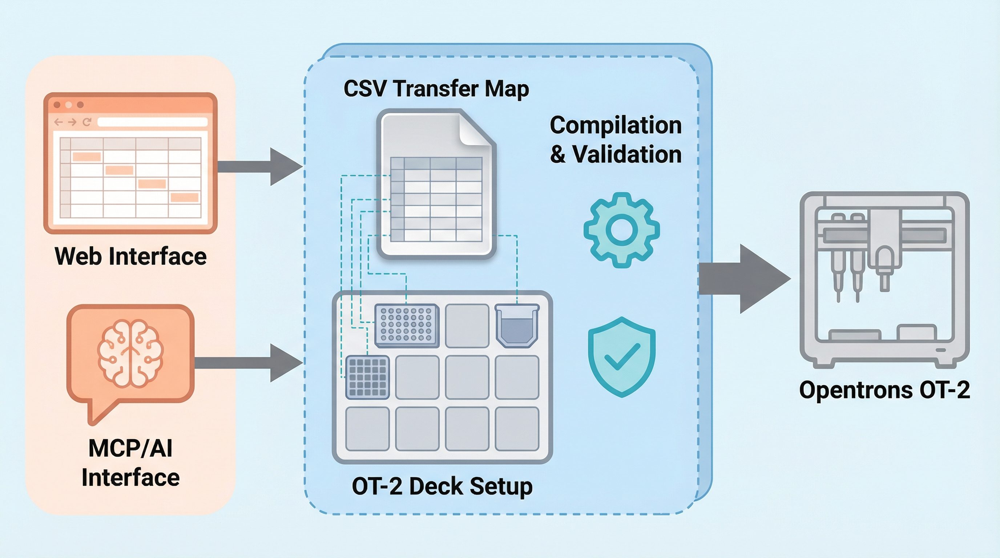

# OT2-CherryPick

[](https://ghcr.io/hitesit/ot2-cherrypick)
[](https://python.org)
[](LICENSE)
[](https://github.com/HiteSit/OT2_CherryPick)

**A zero-install, data-driven cherry-picking platform for the Opentrons OT-2** that bridges the gap between Protocol Designer's accessibility and custom Python scripting's flexibility.

Existing tools for the OT-2 present researchers with a dichotomy: graphical interfaces offer accessibility but lack flexibility for complex workflows, while code-based solutions require programming expertise that excludes many wet-lab scientists. OT2-CherryPick resolves this by combining a browser-based GUI, CSV-driven transfer specification, and comprehensive liquid handling control into a single zero-install platform. All configuration compiles into self-contained protocol files requiring no external dependencies at runtime.



## Features

- **Liquid handling presets** -- Built-in aqueous and viscous profiles, plus custom/manual tuning for volatile or difficult liquids
- **Multi-pipette modes** -- Single-channel, 8-channel single-tip, full 8-channel, and dual-pipette
- **Distribution mode** -- One source to multiple destinations with equal or geometric volume patterns
- **Heater-shaker module support** -- Temperature and shaking control during protocols
- **Simulation-first workflow** -- Validate every protocol with `opentrons_simulate` before touching real samples
- **Auto-UUID deployment** -- Deploy protocols to the Opentrons App with automatic UUID directory creation and analysis generation
- **Calibration offset database** -- Per-labware, per-slot offset tracking for reproducible positioning

## Quick Start with Docker (Recommended)

Run the GUI with Docker Compose from the `docker/` directory. The only required
host-specific setting is the Opentrons App data directory, mounted into the
backend so custom labware and generated protocol folders are available.

```bash
cd docker
cp .env.example .env  # or create .env from the example below
docker compose up -d --build
```

Example `docker/.env`:

```dotenv
COMPOSE_PROJECT_NAME=ot2cherrypick
HOST_PORT=80

OT2_GUI_WORKSPACE=gui_state
OT2_PROJECT_DIR=/app/gui_state

# Opentrons App data root. Do not point this at labware/ or protocols/.
# Windows via WSL/Docker Desktop:
OPENTRONS_DIR_HOST=/mnt/c/Users/YOUR_USERNAME/AppData/Roaming/Opentrons
OPENTRONS_DIR_MOUNT=/mnt/c/Users/YOUR_USERNAME/AppData/Roaming/Opentrons

# Linux example:
# OPENTRONS_DIR_HOST=/home/YOUR_USERNAME/.config/Opentrons
# OPENTRONS_DIR_MOUNT=/home/YOUR_USERNAME/.config/Opentrons
```

Open `http://localhost` when `HOST_PORT=80`, or
`http://localhost:8080` if you set `HOST_PORT=8080`. See
[`docker/README.md`](docker/README.md) for logs, shutdown, volume backup, and
path details.

## MCP Server Integration

The platform architecture exposes all operations through the [Model Context Protocol (MCP)](https://modelcontextprotocol.io/), enabling AI-assisted workflow automation. The MCP server surfaces the full protocol workflow (project setup, deck configuration, liquid handling presets, CSV management, simulation, deployment) as structured tool invocations, allowing natural-language orchestration of complex pipetting experiments while preserving the TOML/CSV files as the source of truth.

<details>
<summary><strong>Configuration</strong></summary>

```json
{
  "mcpServers": {
    "ot2-cherrypick": {
      "command": "uv",
      "args": ["--directory", "/path/to/OT2_CherryPick", "run", "ot2-mcp-server"],
      "env": {
        "OPENTRONS_DIR": "/mnt/c/Users/YOUR_USERNAME/AppData/Roaming/Opentrons"
      }
    }
  }
}
```

</details>

## How It Works

The system follows a three-file workflow:

```
settings.toml + labware_dict.toml + CSVs/*.csv
              |
              v
      helper_cherry_pick.py
              |
              v
    CherryPick_OT2.py (self-contained protocol with embedded JSON)
```

1. **Define transfers** in a CSV file (source wells, dest wells, volumes, heights)
2. **Configure deck layout and liquid handling** in `settings.toml`
3. **Compile and simulate** -- the helper compiles everything into a single Python protocol

The generated protocol embeds all configuration as JSON, requiring no external files at runtime on the OT-2.

## Documentation

| Guide | Description |
|-------|-------------|
| [GUI Guide](docs/gui_guide.md) | 4-step wizard walkthrough for the web interface |
| [Configuration Reference](docs/configuration_reference.md) | Complete settings.toml, labware, CSV format reference |
| [Liquid Handling Guide](docs/liquid_handling_guide.md) | Presets, parameters, and scientific rationale |
| [MCP Tools Reference](docs/mcp_tools_reference.md) | Full MCP tool, resource, and prompt catalog |

## Citation

If you use OT2-CherryPick in your research, please cite:

```bibtex
@article{OT2CherryPick2021,
  title   = {OT2-CherryPick: A Zero-Install Web Platform for Orchestrating
             Complex Liquid Handling on the Opentrons OT-2},
  year    = {2021},
  journal = {ChemRxiv},
  doi     = {10.26434/chemrxiv.15000637},
  url     = {https://chemrxiv.org/doi/full/10.26434/chemrxiv.15000637/v1}
}
```


## Contributing

Contributions are welcome. Please open an issue or pull request on [GitHub](https://github.com/HiteSit/OT2_CherryPick).

## License

[GPL-3.0-or-later](LICENSE)
